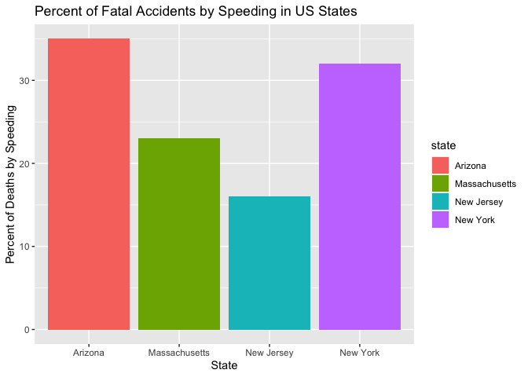

Drivers and Accidents by State
================

## Introduction

US States have different reputations for reckless driving, and many
citizens claim to reside in the state with the highest amount of
accidents or rude drivers. There is, however, only one way to measure
which states have the most reckless drivers that cause fatal deaths–to
look at the data.

## Fatal Deaths by Speeding in Four States

Every year, speeding accounts for 1/4 of all fatal car accidents. This
data below displays a comparison of four different states, and the
percent of fatal accidents caused by speeding each year.

    ## Some larger datasets need to be installed separately, like senators and
    ## house_district_forecast. To install these, we recommend you install the
    ## fivethirtyeightdata package by running:
    ## install.packages('fivethirtyeightdata', repos =
    ## 'https://fivethirtyeightdata.github.io/drat/', type = 'source')

    ## 
    ## Attaching package: 'dplyr'

    ## The following objects are masked from 'package:stats':
    ## 
    ##     filter, lag

    ## The following objects are masked from 'package:base':
    ## 
    ##     intersect, setdiff, setequal, union

    ## Linking to GEOS 3.8.1, GDAL 3.2.1, PROJ 7.2.1

    ## 
    ## Attaching package: 'janitor'

    ## The following objects are masked from 'package:stats':
    ## 
    ##     chisq.test, fisher.test

<!-- -->

## Alcohol Use

Additionally, 1.5 million people yearly are arrested for driving under
the influence. [1] This is due to the high risk of driving while under
the influence, because it severely alters one’s state of mind and can
impair judgement and slow down processing time, making people more
susceptible to accidents. According to the NHTSA, over 1/3 of traffic
incidents are due to alcohol being involved.

    ## Warning in evalq((function (..., call. = TRUE, immediate. = FALSE, noBreaks. =
    ## FALSE, : automatically selected the first layer in a data source containing more
    ## than one.

<!-- -->

[1] National Highway Traffic Safety Administration
